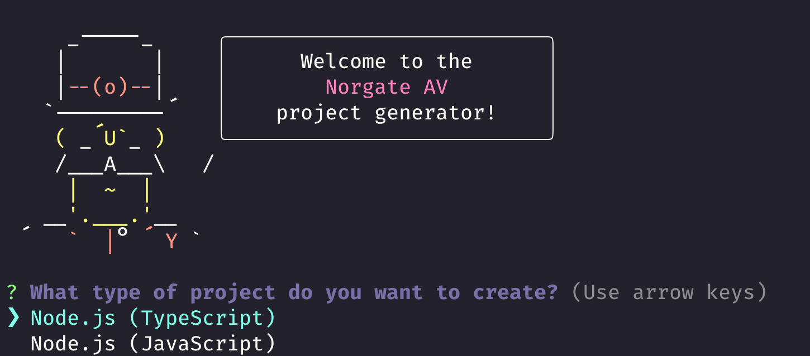

# Yo Norgate-AV - Project Generator

<div align="center">
    
    <!-- <span>-----</span> -->
    
    <!-- <span>-----</span> -->
    
</div>

---

[](https://github.com/Norgate-AV-Solutions-Ltd/generator-norgate-av/actions)
[](https://conventionalcommits.org)
[](http://commitizen.github.io/cz-cli/)
[](#contributors)
[](https://www.npmjs.com/package/generator-norgate-av)
[](LICENSE)

---

A Yeoman generator to bootstrap various projects 🚀🚀🚀

<!-- START doctoc generated TOC please keep comment here to allow auto update -->
<!-- DON'T EDIT THIS SECTION, INSTEAD RE-RUN doctoc TO UPDATE -->

## Contents 📖

-   [Installation :zap:](#installation-zap)
-   [Run Yo Norgate-AV](#run-yo-norgate-av)
-   [Generator Output](#generator-output)
-   [Command Line](#command-line)
-   [Run Generator using Docker :whale:](#run-generator-using-docker-whale)
-   [Team :soccer:](#team-soccer)
-   [Contributors :sparkles:](#contributors-sparkles)
-   [LICENSE :balance_scale:](#license-balance_scale)

<!-- END doctoc generated TOC please keep comment here to allow auto update -->

## Installation :zap:

Install Yeoman and the Norgate AV generator:

```bash
npm install -g yo generator-norgate-av

# or

yarn global add yo generator-norgate-av
```

## Run Yo Norgate-AV

The Yeoman generator will walk you through the steps required to create your project prompting for the required information.

To launch the generator simply type:

```bash
yo norgate-av
```

<div align="center">
    
</div>

## Generator Output

These templates will

-   Create a base folder structure
-   Template out a rough `package.json`

## Command Line

```bash
Usage:
  yo norgate-av [<destination>] [options]

Argument (optional):
  The destination to create the project in, absolute or relative to the current working
  directory. Use '.' for the current folder.
  If not provided, defaults to a folder in the current working directory with the project
  display name.

Options:
  -h,   --help                  # Print the generator's options and usage
  -y,   --yes                   # Quick mode, skip all optional prompts and use defaults
  -o,   --open                  # Open the generated project in Visual Studio Code
  -t,   --projectType           # ts, js...
        --projectId             # Id of the project
        --projectDescription    # Description of the project
  -p,   --pkg                   # 'npm' or 'yarn'
  -g,   --git                   # Initialize a git repo

Example usages:
  yo norgate-av                       # Create an project in a folder with the projects's name.
  yo norgate-av . -o                  # Create an project in current folder and open with Visual Studio Code.
  yo norgate-av cowbell -t ts -y      # Create an TypeScript project in './cowbell', skip prompts, use defaults.
  yo norgate-av dopephish -t js -g    # Create an JavaScript project in './dopephish', initialize a git repository.
```

## Run Generator using Docker :whale:

If you don't want to install nodejs or any node packages, use this method to run the generator from within a Docker container.

```bash
docker run -it -rm -v $(pwd):/usr/src/app generator-norgate-av:latest
```

> or

You can download this bash script from [here](./bin/yo-norgate-av) which wraps the above command into a simple command.

```bash
yo-norgate-av
```

## Team :soccer:

This project is maintained by the following person(s) and a bunch of [awesome contributors](https://github.com/Norgate-AV-Solutions-Ltd/generator-norgate-av/graphs/contributors).

<table>
  <tr>
    <td align="center"><a href="https://github.com/damienbutt"><br /><sub><b>Damien Butt</b></sub></a><br /></td>
  </tr>
</table>

## Contributors :sparkles:

<!-- ALL-CONTRIBUTORS-BADGE:START - Do not remove or modify this section -->

[](#contributors-)

<!-- ALL-CONTRIBUTORS-BADGE:END -->

Thanks go to these awesome people ([emoji key](https://allcontributors.org/docs/en/emoji-key)):

<!-- ALL-CONTRIBUTORS-LIST:START - Do not remove or modify this section -->
<!-- prettier-ignore-start -->
<!-- markdownlint-disable -->

<!-- markdownlint-restore -->
<!-- prettier-ignore-end -->

<!-- ALL-CONTRIBUTORS-LIST:END -->

This project follows the [all-contributors](https://allcontributors.org) specification.
Contributions of any kind are welcome!

Check out the [contributing guide](CONTRIBUTING.md) for more information.

## LICENSE :balance_scale:

[MIT](LICENSE)
